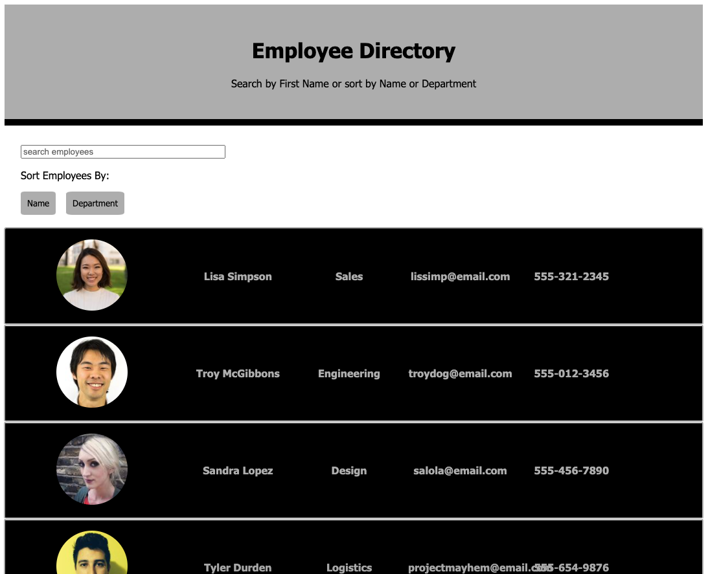

# Employee Directory

## Table of Contents
* [Description](#description)
* [Usage](#usage)
* [Tests](#test)
* [Questions](#questions)
* [Contributing Authors](#contributors)
* [License](#license)

# Description
An employee directory created with React. With this application, a user is able to view the entire employee directory at once so that they have quick access to the employees' information. An employee or manager would benefit greatly from being able to view non-sensitive data about other employees. Employees can be searched by first name, or filtered in alphabetical order by first name in ascending or descending order, as well as filtered by department. 

* <a href="https://cascutter.github.io/react-employee-directory/">Link to Deployed App on GitHub Pages.</a>

    
## Usage
The application allows users to accomplish the following tasks:

* View all employee's and their information

* Search for employees by first name.

* Sort employees in alphabetical order by first name in ascneding or descending order.

* Sort employees by department.

          
## Tests
All tests currently passing.

            
## Questions
All questions regarding this application can be directed to: 
 
<a href="https://github.com/cascutter">cascutter</a> 

<a href="mailto:cascutter13@gmail.com">cascutter13@gmail.com</a>
    
# Contributing Authors
* Casandra Cutter (functionality)
    
# License
ISC License
